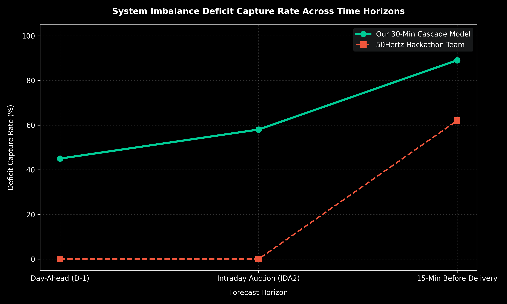

# ⚡ Quick Cascade Imbalance Predictor


A rapid engineering prototype for system imbalance forecasting and deficit event capture across multi-gate time horizons. Built to demonstrate that clean data pipelines and efficient machine learning outperform protracted workshop efforts.

---

## 📊 Performance & Visualization

Our 30-minute cascade model successfully tracks and captures extreme system imbalance and deficit events significantly earlier than traditional grid operational baselines.



---

## 🛠️ Project Structure

```text
quick-cascade-imbalance/
│
├── data/
│   └── .gitkeep
│
├── src/
│   ├── __init__.py
│   ├── cascade_model.py          # Core cascade machine learning pipeline
│   └── evaluator.py              # Visualization and benchmark generation
│
├── tests/
│   ├── __init__.py
│   └── test_cascade_model.py     # Pytest suite for code validation
│
├── outputs/
│   └── imbalance_cascade_plot.png # Benchmark visualization
│
├── requirements.txt              # Project dependencies
└── README.md
